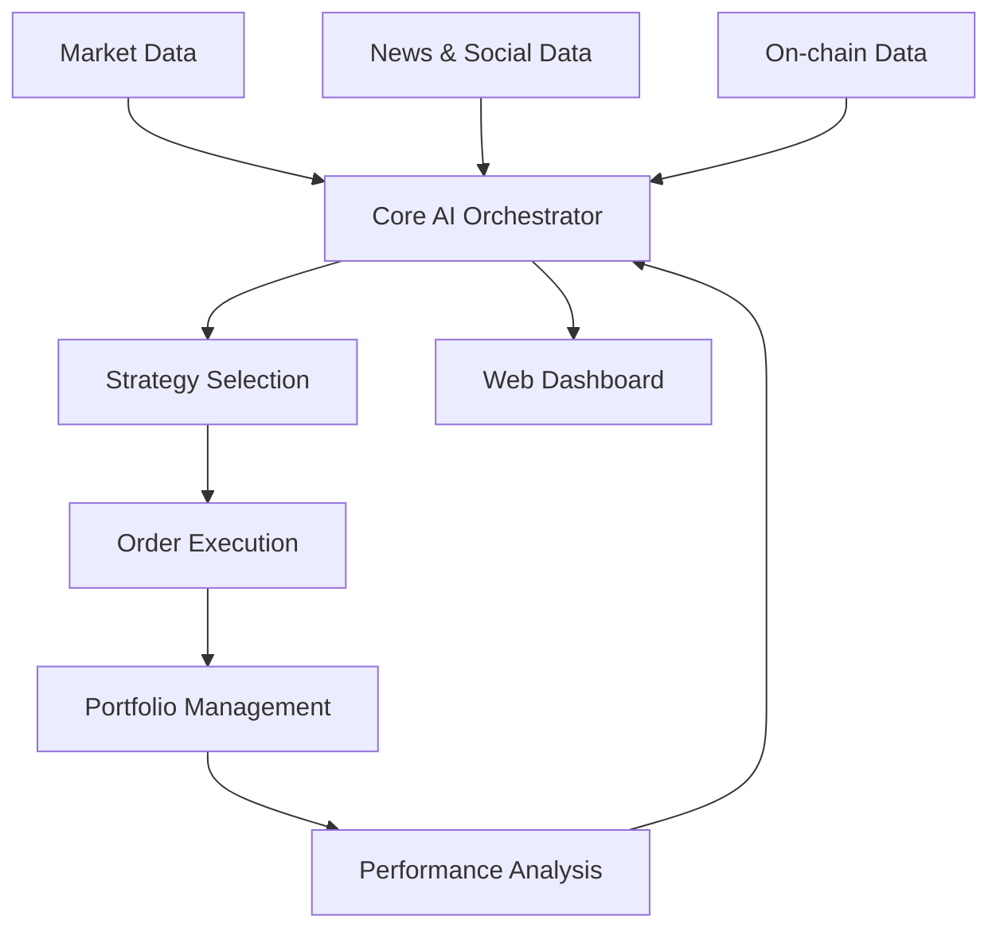

<!-- markdownlint-disable MD033 -->
<div align="center">
  
# 🚀 ALL-CRYPTO

### Advanced AI-Powered Cryptocurrency Trading System

[](https://www.python.org/downloads/release/python-3100/)
[](https://opensource.org/licenses/MIT)
[](https://www.binance.com/en/futures)
[](https://en.wikipedia.org/wiki/Reinforcement_learning)


*A sophisticated algorithmic trading system that leverages AI, machine learning, and advanced market analysis to power your cryptocurrency trading*

</div>

---

## 📋 Table of Contents

- [Overview](#-overview)
- [Key Features](#-key-features)
- [System Architecture](#-system-architecture)
- [Installation](#-installation)
- [Configuration](#-configuration)
- [Usage](#-usage)
- [Project Structure](#-project-structure)
- [Security](#-security)
- [Contributing](#-contributing)
- [License](#-license)
- [Disclaimer](#-disclaimer)

---

## 🔭 Overview

ALL-CRYPTO is a comprehensive trading system designed to identify and execute profitable trades in cryptocurrency futures markets. Built on cutting-edge AI technologies, the system continuously analyzes market conditions, executes trades based on sophisticated strategies, and adapts to changing market dynamics.

> "The intelligent investor is a realist who sells to optimists and buys from pessimists." — Benjamin Graham

---

## ✨ Key Features

<table>
  <tr>
    <td>
      <h3>🧠 AI-Powered Trading</h3>
      <ul>
        <li>Neural networks for pattern recognition</li>
        <li>Reinforcement learning for trade decisions</li>
        <li>Adaptive strategy optimization</li>
      </ul>
    </td>
    <td>
      <h3>📊 Advanced Analysis</h3>
      <ul>
        <li>Technical indicators & pattern recognition</li>
        <li>On-chain metrics & token economics</li>
        <li>News & social sentiment analysis</li>
      </ul>
    </td>
  </tr>
  <tr>
    <td>
      <h3>⚡ Trading Arsenal</h3>
      <ul>
        <li>Multiple strategy implementations</li>
        <li>Momentum, mean reversion, arbitrage</li>
        <li>Market making & event-driven strategies</li>
      </ul>
    </td>
    <td>
      <h3>🛡️ Risk Management</h3>
      <ul>
        <li>Dynamic position sizing</li>
        <li>Drawdown controls & circuit breakers</li>
        <li>Portfolio optimization</li>
      </ul>
    </td>
  </tr>
  <tr>
    <td>
      <h3>🖥️ User Interface</h3>
      <ul>
        <li>Real-time trading dashboard</li>
        <li>Performance analytics</li>
        <li>Strategy visualization</li>
      </ul>
    </td>
    <td>
      <h3>🔄 Flexibility</h3>
      <ul>
        <li>Demo/Live account switching</li>
        <li>Cloud deployment ready</li>
        <li>Modular & extensible architecture</li>
      </ul>
    </td>
  </tr>
</table>

---

## 🏗️ System Architecture



---

## 🔧 Installation

### Prerequisites

- Python 3.10+
- Conda environment manager
- Valid Binance API keys (other exchanges coming soon)

### Setup Process

1. **Clone the repository**:
   ```bash
   git clone https://github.com/Pusparaj99op/ALL-CRYPTO.git
   cd ALL-CRYPTO
   ```

2. **Create and activate conda environment**:
   ```bash
   conda create -n richie_rich python=3.10
   conda activate richie_rich
   ```

3. **Install dependencies**:
   ```bash
   pip install -r requirements.txt
   ```

4. **Configure environment**:
   ```bash
   cp .env.example .env
   # Edit .env with your API keys and preferences
   ```

---

## ⚙️ Configuration

The system uses a combination of configuration files and environment variables:

- **API Keys**: Set in `.env` file (never commit this to version control)
- **Trading Parameters**: Configurable in `config/trading_config.yaml`
- **Risk Management**: Settings in `config/risk_config.yaml`
- **Strategy Parameters**: Customize in `config/strategy_config.yaml`

Detailed configuration options are available in our [Configuration Documentation](docs/configuration.md).

---

## 🚀 Usage

### Starting the Trading System

```bash
python main.py
```

### Command Line Options

```bash
python main.py --demo        # Run in demo mode
python main.py --backtest    # Run backtesting
python main.py --optimize    # Run strategy optimization
```

### Web Dashboard

Access the web dashboard at http://localhost:5000 after starting the system.


---

## 📂 Project Structure

```
ALL-CRYPTO/
├── core/                # Central orchestration & system components
├── analysis/            # Market analysis modules
│   ├── technical/       # Technical indicators & patterns
│   ├── fundamental/     # On-chain & token economics
│   ├── sentiment/       # News & social analysis
│   └── ...
├── ml/                  # Machine learning models
├── execution/           # Order execution & management
├── strategies/          # Trading strategy implementations
├── utils/               # Utilities & helpers
├── web/                 # Web interface & API
├── interfaces/          # Exchange & data provider integrations
└── ...
```

See [structure.txt](structure.txt) for complete project structure.

---

## 🔐 Security

- **API Keys**: Never share your API keys and store them securely
- **Security Measures**: Use appropriate security as outlined in our [Security Guide](docs/security.md)
- **Account Protection**: Enable Two-Factor Authentication on all exchange accounts
- **Limited Permissions**: Use API keys with minimal required permissions

---

## 👥 Contributing

We welcome contributions! Please see [CONTRIBUTING.md](CONTRIBUTING.md) for guidelines.

---

## 📜 License

This project is licensed under the MIT License - see the [LICENSE](LICENSE) file for details.

---

## ⚠️ Disclaimer

**This software is for educational and research purposes only.**

Trading cryptocurrencies involves significant risk of loss. Use this software at your own risk. The creators and contributors are not responsible for any financial losses incurred through the use of this system.

Past performance is not indicative of future results. Always conduct your own research before trading.

---

<div align="center">
  
  **[⬆ Back to Top](#-all-crypto)**
  
  <a href="https://github.com/Pusparaj99op/ALL-CRYPTO/stargazers">⭐ Star us on GitHub</a> | 
  <a href="https://github.com/Pusparaj99op/ALL-CRYPTO/issues">🐛 Report an Issue</a>
  
</div>
